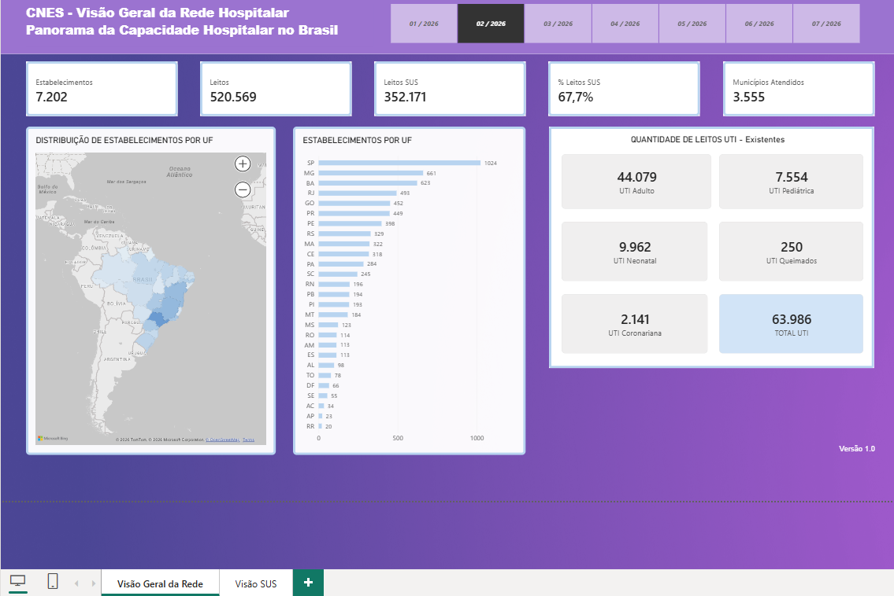

# CNES Health Analytics

Projeto de Engenharia e Análise de Dados desenvolvido a partir de dados públicos do **Cadastro Nacional de Estabelecimentos de Saúde (CNES)**.

O objetivo é construir um pipeline completo de dados para analisar a capacidade hospitalar brasileira, passando pelas etapas de **extração, validação, transformação, modelagem dimensional, armazenamento em PostgreSQL e visualização no Power BI**.

## Dashboard

### Visão Geral da Rede Hospitalar

A primeira página do dashboard apresenta uma visão geral da capacidade hospitalar por competência, permitindo acompanhar indicadores nacionais e sua distribuição geográfica.



Entre os principais indicadores apresentados estão:

- quantidade de estabelecimentos;
- total de leitos existentes;
- total e percentual de leitos SUS;
- municípios atendidos;
- distribuição de estabelecimentos por UF;
- distribuição geográfica dos estabelecimentos;
- quantidade de leitos UTI existentes por tipo:
  - Adulto;
  - Pediátrica;
  - Neonatal;
  - Queimados;
  - Coronariana.

O dashboard permite selecionar a **competência (mês/ano)**, atualizando os indicadores e visualizações de forma integrada.

### Validação dos indicadores

Os principais indicadores apresentados no Power BI foram validados
diretamente no PostgreSQL através de consultas SQL.

As consultas utilizadas para conferência da aba "Visão Geral" estão disponíveis em:

`sql/validation_queries_visao_geral.sql`

## Arquitetura do Projeto

```text
Dados CNES
    │
    ▼
Extract
    │
    ▼
Validate
    │
    ▼
Transform
    │
    ▼
Load
    │
    ▼
PostgreSQL
    │
    ▼
Power BI
```

O pipeline é orquestrado em Python e realiza desde a leitura dos arquivos de origem até a carga das dimensões e da tabela fato no banco de dados.

## Modelagem Dimensional

O modelo analítico foi estruturado utilizando uma abordagem dimensional.

### Dimensões

**dim_tempo**

Armazena as competências utilizadas nas análises.

Principais atributos:

- competência;
- ano;
- mês.

**dim_estabelecimento**

Contém informações cadastrais dos estabelecimentos de saúde.

Principais atributos:

- CNES;
- nome do estabelecimento;
- razão social;
- tipo de gestão;
- tipo de unidade;
- natureza jurídica.

**dim_localidade**

Contém as informações geográficas dos estabelecimentos.

Principais atributos:

- código IBGE;
- região;
- UF;
- estado;
- município.

### Tabela Fato

**fact_capacidade_hospitalar**

Centraliza os indicadores de capacidade hospitalar por estabelecimento e competência.

Entre os dados armazenados estão:

- leitos existentes;
- leitos SUS;
- leitos não SUS calculados;
- UTI Adulto;
- UTI Pediátrica;
- UTI Neonatal;
- UTI Queimados;
- UTI Coronariana;
- totais SUS e não SUS das categorias de UTI.

A tabela fato se relaciona às dimensões por meio das respectivas chaves substitutas (`id_tempo`, `id_estabelecimento` e `id_localidade`).

## Pipeline ETL

### Extract

Responsável pela leitura dos arquivos brutos utilizados no processamento.

### Validate

Executa validações antes da transformação, incluindo verificações de dados nulos e duplicidades em campos utilizados como chaves do processamento.

### Transform

Responsável pela preparação dos dados para o modelo dimensional.

Entre as transformações realizadas estão:

- padronização dos nomes das colunas;
- tratamento de CNES e código IBGE;
- criação das dimensões;
- decomposição da competência em ano e mês;
- enriquecimento da dimensão de localidade com o nome dos estados;
- cálculo dos quantitativos de leitos não SUS;
- preparação da tabela fato.

### Load

Realiza a carga no PostgreSQL.

A execução segue a ordem:

```text
dim_tempo
    ↓
dim_localidade
    ↓
dim_estabelecimento
    ↓
fact_capacidade_hospitalar
```

Após a carga das dimensões, suas chaves são recuperadas e associadas aos registros da tabela fato.

## Tecnologias

- Python
- Pandas
- SQLAlchemy
- PostgreSQL
- Docker / Docker Compose
- Power BI
- Git

## Estrutura

```text
cnes-health-analytics/
│
├── data/
│   └── raw/
│       ├── estabelecimentos/
│       └── leitos/
│
├── docs/
│   └── images/
│       └── cnes-visao-geral.png
│
├── src/
│   ├── config/
│   ├── database/
│   ├── etl/
│   │   ├── extract/
│   │   ├── validate/
│   │   ├── transform/
│   │   └── load/
│   ├── profiling/
│   └── orchestrator.py
│
├── .env.example
├── docker-compose.yml
├── main.py
└── README.md
```

## Execução

Com o ambiente configurado e o PostgreSQL disponível, o pipeline principal pode ser executado através de:

```bash
python3 main.py
```

O profiling dos arquivos foi mantido separado do fluxo principal e pode ser executado como módulo:

```bash
python3 -m src.profiling.profiling
```

## Dados

Os dados utilizados no projeto são provenientes do **Cadastro Nacional de Estabelecimentos de Saúde (CNES)**.

Os arquivos brutos não são versionados no repositório. A estrutura das pastas é preservada através de arquivos `.gitkeep`.
